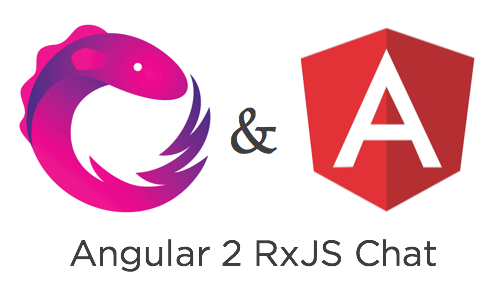
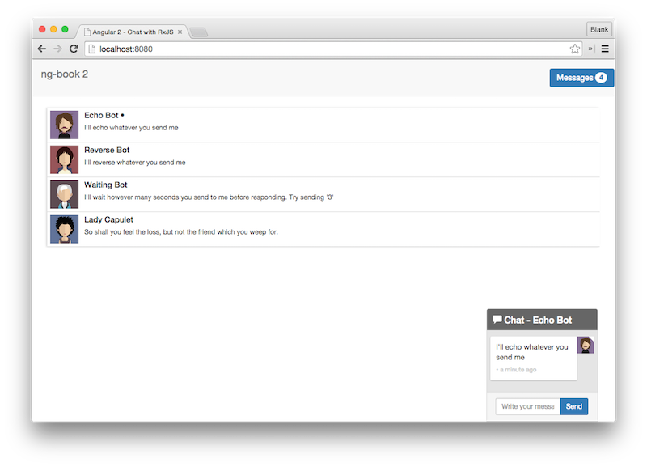

  

# Angular RxJS Chat 

This repo shows an example chat application using RxJS and Angular. The goal is to show how to use the Observables data architecture pattern within Angular. It also features:

* Angular CLI, which configures Webpack with TypeScript, Karma, and tslint
* Writing async components that work with RxJS
* How to write injectable services in Angular
* And much more

  

## License
 [MIT](/LICENSE.md)
